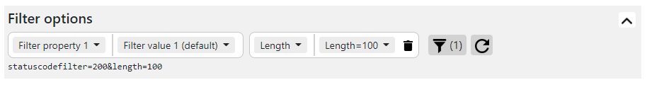
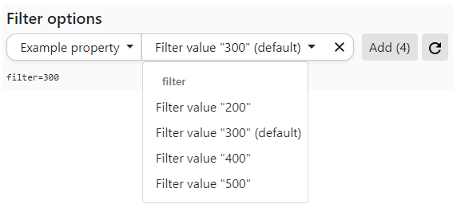
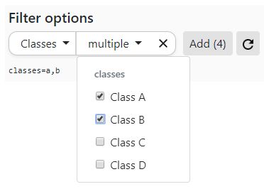
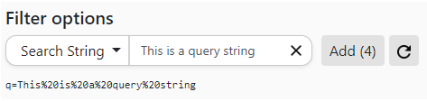
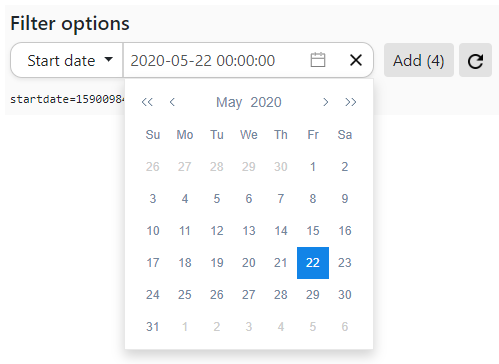

# vue-filter-bar 
A Vue2 component which provides a configurable filter bar for url-based API queries.

**Version: r1.0.0**


[](https://opensource.org/licenses/MIT)


 


## Install

Due this is a vue.js component. [vue.js](https://vuejs.org/) is required.

```html
<!--Load vi-filter-bar stylesheet-->
<link rel="stylesheet" href="./css/component-filter_bar.css">
<!--Load vi-filter-bar component-->
<script src="./js/vi-filter-bar.js"></script>

```
Additional dependencies are:
* [Bootstrap](https://getbootstrap.com/)
* [Popper](https://popper.js.org/) (required for dropdown) *Single & Multi filter
* [vue2-datepicker](https://github.com/mengxiong10/vue2-datepicker) *Date filter

## Usage

Just place the vi-filter-bar at the position you need it. 

```html
<vi-filter-bar v-bind:options="filterRequestOptions" v-on:trigger-callback="callback($event)"></vi-filter-bar>
```

## Filter Types
Filter type is controlled via the *selectionMode* property.

### Single
The single filter allows a single selection.



### Multi
The multi select filter allows the user the selection of multiple choices.
The single values are separated in the return by a definable delimiter.
If the delimiter is not defined *comma* will be used by default.



### Search
The search filter allows the input of any search text. The filter value is returned in URL encoded  format using the ES6 method *encodeURIComponent()*



### Date
The Date filter allows the user to select a date with time from the date/time picker. The filter value is returned in UNIX format.



The external component [vue2-datepicker](https://github.com/mengxiong10/vue2-datepicker) is used for the date picker.

## API Reference
```javascript
filterRequestOptions: {
  uri: '',
  filters:[
    //Filters
  ]
}
```

### Single filter
```javascript
{
  label: 'string',                           
  filterProperty: 'string',
  selectionMode: 'single',
  values: [
    {
      label:'string',
      filterValue: 'string'
    }
  ]
}
```

### Multi filter
```javascript
{
  label: 'string',                            
  filterProperty: 'string',
  selectionMode: 'multiple',
  delimiter: ',',
  values: [
      {
        label:'string',
        filterValue: 'string'
      }
  ]
}
```

### Search filter
```javascript
{
  label: 'string',                            
  filterProperty: 'string',
  selectionMode: 'search'
}
```

### Date filter
```javascript
{
  label: 'string',                            
  filterProperty: 'string',
  selectionMode: 'date'
}
```
### Callback function
The callback function will be called if the reload button is clicked. The *uri* contains the whole filter uri. This is generated by combining all filters.
```javascript
callback: function(uri){
  alert("callback has been called with URI = " + uri);
}
```
## Styling
The style can be customized by adjusting the CSS file accordingly. An existing UI framework is recommended. e.g. [Bootstrap](https://getbootstrap.com/)

## License

**MIT License**  |  Copyright (c) 2020 geopackix

[LICENSE](./LICENSE)